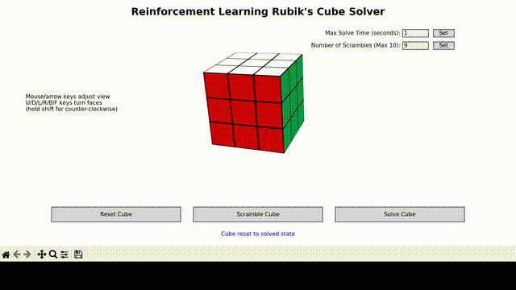

# Reinforcement Learning Rubiks Cube Visualizer and Solver

## Description
This project features a 3D Rubik's Cube visualizer and solver using the Monte Carlo Tree Search (MCTS) algorithm augmented by a deep reinforcement learning neural network. The visualizer was developed in Python with `matplotlib`, leveraging quaternion rotation matrices to rotate the cube in 3D space. The Rubik’s Cube visualizer was built using the [MagicCube repo](https://github.com/davidwhogg/MagicCube/tree/master) written by David W. Hogg and Jacob Vanderplas. The solver implements a modified form of the ADI (Autodidactic Iteration) algorithm for solving the Rubik's Cube, based on the research paper: [Solving the Rubik’s Cube Without Human Knowledge](https://arxiv.org/abs/1805.07470).

This project is designed to handle Rubik's cubes of any size (NxN). The visualizer, algorithm, and model are fully generalized for cubes of any dimension. However, the current model has only been trained on 3x3 Rubik’s cubes, providing a foundation for future expansion to larger cubes.

## Demo
Demo showcasing the algorithm solving a 3x3 Rubik's Cube scrambled 9 times in under 1 second (excluding model loading time).



## Installation & Setup
This setup is intended for both Windows and Linux. You will need Python 3.11 or higher and Poetry version 1.8.3, which is the primary dependency manager. If Poetry isn’t installed, you can install it globally in your base Python environment and create a Conda environment (or use an existing Python 3.11+ installation) to manage the dependencies.

1. Prerequisites
- Poetry Installation
Poetry needs to be installed in the base Python environment. Once installed, it will manage dependencies inside the Conda or Python environment.
Install Poetry globally in base Python (if not already installed):
```
pip install poetry==1.8.3
```
- Python
  - Option 1: If you already have Python 3.11 or higher, skip to running the visualizer.
  - Option 2: Create a Conda environment for Python 3.11:
```
conda create -n rubiks_cube_solver python=3.11
conda activate rubiks_cube_solver
```

2. Running the Visualizer
  - On Windwows
    - Run the run.bat file - `run.bat` in the command prompt.

  - On Linux
    - Make the run.sh file executable and run it:
    ```
    chmod +x run.sh
    ./run.sh
    ```   
  - This will:
      - Install Poetry if not present.
      - Set up dependencies.
      - Start the server and launch the visualizer.

## Additional Commands
- On Windows
  - To remove the Poetry environment and cached files, run - `run.bat clean`.
  - If you only want to install the dependencies and set up the environment, run: - `run.bat install`

- On Linux
  - To remove cached files: `./run.sh clean`
  - To only install dependencies and set up the environment: `./run.sh install`

## Usage
After installation, you can use the solver as follows:
- Start the application:
  - On Windows: `run.bat`
  - On Linux: `./run.sh`   
- Use the GUI to interact with the Rubik's Cube:
  - Click 'Scramble Cube' to randomize the cube state.
  - Adjust 'Max Solve Time' and 'Number of Scrambles' as needed.
  - Click 'Solve Cube' to watch the algorithm solve the cube.
- To stop the application:
  - Close the GUI window.
  - The script will automatically terminate the server process.

Note: Ensure you're in the project directory when running these commands.

## Pretrained Models, Data Generation, and Training

- Using Pretrained Models
The project includes pretrained weights for solving the 3x3 Rubik's Cube. These weights are available in the trained_models directory. You can directly use the pretrained model without retraining by running the visualizer as described in the installation section.

- Data Generation
To generate datasets for training or experimentation with the cube, use the `generate_dataset.py` script. Customize the parameters as needed.

- Training Your Own Model
You can train the model using the `run_training.py` script. Customize the training parameters, such as epochs, batch size, and learning rate.

- Training Setup:
  - CUDA version: 12.4
  - GPU: NVIDIA GeForce 1650 Ti
  - Training Data: The model was trained on 800,000 randomly generated scrambled cube states and validated on 200,000 cube states, with a maximum scramble length of 10.
  - Pretrained weights for the 3x3 Rubik's Cube are located in the trained_models directory.

## Algorithm Performance
The Algorithm (model weights used: `trained_models/3x3/maxback10/best_model_epoch_97.pt`) demonstrates high accuracy and efficiency for scramble lengths up to 10. Below are the results of testing the algorithm on 100 randomly scrambled cubes, each with the specified scramble length:

| Scramble Length | Solution Rate (%)	| Average Solution Length |
|-----------------|-------------------|-------------------------|
|6	|97|	5.18|
|7	|89|	5.63|
|8	|79|	5.97|
|9  |71|	7.17|
|10 |51|	6.51|


